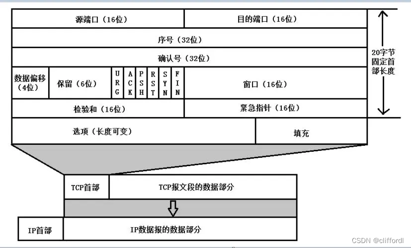
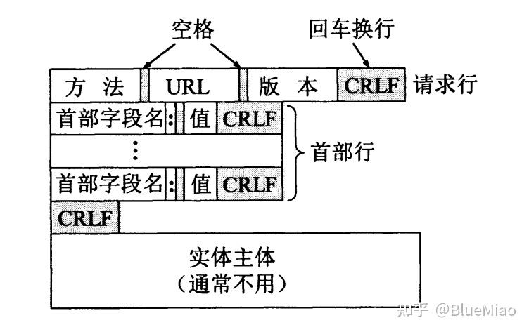

# 网络概述
## 不同网络模型
### OSI网络七层模型
应用层:最终呈现

表示层:转换数据格式

会话层:建立和断开链接

传输层:数据报文（TCP和UDP）

网络层:数据分组（IP和子网掩码）

数据链路层:数据帧

物理层:比特

### TCP/IP体系结构
<a id="networkModule"></a>
应用层:[FTP](#FTP)、[SMTP](#SMTP)、[HTTP](#HTTP)

传输层:定义端口,表示应用程序,实现端到端通信 

网络层:IP层,负责IP数据包的路由和传输

数据链路层:网络接口层,包含了OSI的物理层和数据链路层
## 不同层级的协议和介绍
### 应用层（TCP/IP模型下）
#### FTP<a id="FTP"></a>

[返回网络模型章节](#networkModule)
#### SMTP<a id="SMTP"></a>

[返回网络模型章节](#networkModule)
#### HTTP<a id="HTTP"></a>
HTTP是无状态的,使用HTTP Cookie就可以使用有状态的会话。

HTTP底层 TCP、QUIC。

##### 为什么是无状态的
不会保持数据
比如登陆，如果不做处理，在login以后，就不知道这个连接是否登陆过。

###### session、cookie、token

cookie:服务器向浏览器发一个cookie，浏览器保存起来，下次交互通过携带cookie交互来保持数据。cookie不可以跨域名。

session:服务端保存客户端信息

token:

##### HTTP可以控制什么
缓存: 文档如何被缓存,服务端可以指示代理和客户端缓存哪些内容以及多久,客户端可以指示中间缓存代理忽略已存储的文档。

开放同源限制:为了组织网络监听和隐私侵犯,web浏览器在不同网站之间分割,只有相同来源的网页才可以获取一个网页的全部信息。

认证:仅允许特定用户访问,可以通过WWW-Authenticate和HTTP cookie来设置特定会话。

代理服务器和隧道:越过内网屏障，比如SOCKS协议

会话:HTTP Cookie

##### HTTP流
1. 打开一个TCP
2. 发送HTTP报文
```go
GET / HTTP/1.1
Host: developer.mozilla.org
Accept-Language: zh
```
3. 读取返回的报文信息
```go
HTTP/1.1 200 OK
Date: Sat, 09 Oct 2010 14:28:02 GMT
Server: Apache
Last-Modified: Tue, 01 Dec 2009 20:18:22 GMT
ETag: "51142bc1-7449-479b075b2891b"
Accept-Ranges: bytes
Content-Length: 29769
Content-Type: text/html

<!DOCTYPE html>…（此处是所请求网页的 29769 字节）

```
4. 关闭连接或为后续请求重用连接

###### 请求
**Method**(POST,PUT,TRACE,CONNECT,GET,HEAD,DELETE,OPTIONS) **URI Protocol version** 
[介绍](https://www.cnblogs.com/machao/p/5788425.html)

Headers(Host、User-Agent、Accpet、Accpet-Language、Accept-Encoding、Connection、Upgrade-Insecure-Requests、Content-Type、Conten-Length)

Empty line

Body

###### 响应
**Protocol version**,**Status code**(1xx:临时响应,2xx:成功状态码,3xx:重定向状态码,4xx:客户端错误,5xx:服务器错误),**Status message**

Headers(General header,Response header,Representation header)

Empty line

Body
[返回网络模型章节](#networkModule)
REFERENCE
[HTTP](https://developer.mozilla.org/zh-CN/docs/Web/HTTP)

###### Method
Get:幂等的,浏览器缓存Get,空Body,请求参数在url中
Post:不幂等的,实体Body
PUT:幂等的

#### HTTPS
HTTP+SSL/TLS
CA证书
端口443

### 传输层
#### TCP和UDP
##### 端口
适用源IP、源端口、目的IP、目的端口、协议号来标识一个通信
0～1023:应用层协议端口,ssh 22;ftp 21;Telnet 23;HTTP 80;
1024～65535
##### 报文结构
TCP报文
|参数名称|长度|说明|
|:-:|:-:|:-:|
|源端口|16|发送方端口|
|目的端口|16|接收方端口|
|seq number|32|字节流编号|
|ack number|32|应答顺序号|
|偏移|4|TCP包头长度|
|保留位|6||
|URG|1|紧急标志位|
|ACK|1|确认标志位|
|PSH|1|推送标志位|
|RST|1|复位标志位:1代表需要重连|
|SYN|1|同步标志位:1代表连接请求报文|
|FIN|1|终止标志位:1代表断开连接|
|窗口|16|从本报文段首部中的确认号开始,接收方目前允许对方一次发送的数据量|
|CheckSum|16|包括首部和数据两部分的CRC16|
|紧急指针|16||
|可选部分|0-40||
|数据部分|N||


UDP报文

|参数名称|长度|说明|
|:-:|:-:|:-:|
|源端口|16|发送方的端口号|
|目的端口|16|接收方的端口号|
|总长度|16|首部+数据内容|
|校验和|16|数据校验和|
|数据部分|N||
##### 异同
|特性|TCP|UDP|
|:---:|:---:|:---:|
|连接|有连接的|无连接的|
|数据格式|流模式|数据报模式|
|数据正确性|确保|不确保|
|数据顺序|保证顺序|不保证|

编码上的区别
TCP编码一般流程:
    Server:
        创建一个socket,用函数socket();

        设置socket属性,用函数setsockopt(); * 可选

        绑定IP地址、端口等信息到socket上,用函数bind();

        开启监听,用函数**listen()**;

        接收客户端上来的连接,用函数**accept()**;

        收发数据,用函数send()和recv(),或者read()和write();

        关闭网络连接;

        关闭监听;
    Client:
        创建一个socket,用函数socket();

        设置socket属性,用函数setsockopt();* 可选

        绑定IP地址、端口等信息到socket上,用函数bind();* 可选

        设置要连接的对方的IP地址和端口等属性;

        连接服务器,用函数**connect()**;

        收发数据,用函数send()和recv(),或者read()和write();

        关闭网络连接;

UDP编码一般流程:
    Server:
        创建一个socket,用函数socket();

        设置socket属性,用函数setsockopt();* 可选

        绑定IP地址、端口等信息到socket上,用函数bind();

        循环接收数据,用函数**recvfrom()**;

        关闭网络连接;
    Client:
        创建一个socket,用函数socket();

        设置socket属性,用函数setsockopt();* 可选

        绑定IP地址、端口等信息到socket上,用函数bind();* 可选

        设置对方的IP地址和端口等属性;

        发送数据,用函数**sendto()**;

        关闭网络连接;
具体编程差别
    socket()的参数不同

    UDP Server不需要调用listen和accept

    UDP收发数据用sendto/recvfrom函数

    TCP:地址信息在connect/accept时确定

    UDP:在sendto/recvfrom函数中每次均 需指定地址信息

    UDP:shutdown函数无效
##### TCP建立连接和断开连接

建立连接:
    第一次:SYN=1,seq number = x;

    第二次:ACK=1,ack number = x+1,SYN=1 seq number=y;

    第三次:ACK=1,ack number=y+1,seq number = x+1;

    **为什么要三次握手**:

        TCP,双工,在第二次握手的时候,发送方的Send和接收方的Receive功能正常是双向可知的,此时需要第三次握手去去确认发送方的Receiver和接收方的Send功能正常。
断开连接:
    第一次:FIN=1,seq number = n;

    第二次:ACK=1,ack number = n+1;

    CLOSE-WAIT,接收方可以接收，不可以发送;

    第三次:FIN=1,seq number = m;

    第四次:ACK=1,seq number=m+1;

    TIME-WAIT;

    **为什么要四次挥手**:
        因为建立连接的时候,合并了一次收发的操作。而且一次挥手只能断开一方的连接。
##### TCP中拥塞控制、流量控制
拥塞控制主要针对网络资源的局部或者全局短缺问题

流量控制主要针对的是数据接受方的处理能力，滑动窗口，窗口越大，网络吞吐量越大，接收方一旦发现自己的缓冲区快满了，将窗口设置为更小的值通知发送方。
###### 拥塞控制
拥塞窗口 cwnd 最大报文段 MSS
最开始cwnd值为1，收到一个ACK，则MSS+1，慢开始阈值，ssthresh
1. 当cwnd < ssthresh 启用慢启动
2. 当cwnd > ssthresh 使用拥塞避免算法
接受窗口 rwnd 

拥塞避免算法

1. 让cwnd缓慢增长，每一轮往返时间RTT就把cwnd+1而不是加倍。

快重传和快恢复
快重传要求收到重复报文段的时候立即，发起重复请求

快恢复
当发送方连续收到3个重复确认，执行乘法减小算法，把sshtresh阈值减半
将cwnd设置为sshtresh以后执行拥塞避免算法。


### 网络层

#### IP

# 面试
## 输入www.baidu.com以后发生了什么
DNS解析
    浏览器缓存
    系统缓存
    路由器缓存
    ISP的DNS服务器
    根服务器
建立TCP/IP连接
    三次握手建立连接
    HTTPS四次握手
发送请求
    HTTP报文结构
        
服务器处理请求
返回HTTP响应
浏览器渲染
## TCP怎么保证可靠性
1. 校验和，保证底层传输的正确性
2. 序列号，保证传输顺序正确，多/少数据一清二楚，多次发送，一次确认
3. 确认应答机制，通过ACK和ack number确认到达的数据值
4. 超时重传，发出后一段时间未确认就会进行重传
5. 连接管理（三次握手和四次挥手）
6. 流量控制
7. 拥塞控制